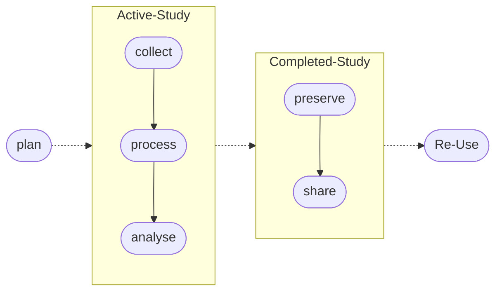

## Introduction
Data often have a longer lifespan than than the research projects that creates them. Researchers may continue to work on data after funding has finished, follow-up projects may analyse or add to the data, and data may be used by other researchers.

A useful concept that helps us think about the stages of data handling is the Data Lifecycle (DLc) <mark>(REF)</mark>.    

The DLc takes us through **seven** stages of our research project:

- planning your data handling
- collecting data, 
- processing data, 
- analysing data, 
- preserving data, 
- sharing data,
- re-using data    
  
## Using the DLc for research planning
A great way to get started is to <mark>use this data lifecycle template</mark> to quickly list the points in your project at which you think data management procedures should be implemented. Here is an example set of tasks, and when in the process they might be considered.

|Data Lifecycle Stage|Data Handling Task|
|---|---|
|
flowchart LR;A([Plan]);
|<ul><li>Study design</li><li>Data management plan</li><li>Statistical analysis plan</li><li>Existing data source search</li><li>Software for research planning</li><ul>|
|
flowchart LR;A([Collect]);
|<ul><li>Databasing</li><li>Data dictionary</li><li>Study operations</li><li>Real-time quality control</li><li>Minimising non-response</li><li>Software for data collection</li><ul>|
|
flowchart LR;A([Process]);
|<ul><li>Create metadata</li><li>Post collection quality control</li><li>Data preparation for analytics</li><li>Managing and storing research datasets</li><li>File management and formats</li><li>Software for data processing</li><ul>|
|
flowchart LR;A([Analyse]);
|<ul><li>Software for analysing quantitative data</li><li>Software for analysing qualitative data</li><li>Creating an analytics report</li><li>Collaborative analytics</li><ul>|
|
flowchart LR;A([Preserve]);
|<ul><li>Data preservation</li><li>Data security</li><li>Protecting personally identifiable information</li><li>Caribbean data protection regulations</li><li>Software for data preservation</li><ul>|
|
flowchart LR;A([Share]);
|<ul><li>Data sharing</li><li>Benefits of data sharing</li><li>Open data and FAIR data</li><li>intellectual property and copyright</li><li>Licensing research data</li><li>Software for data sharing</li><li>Digital Object Identifiers</li><ul>|
|
flowchart LR;A([Re-use]);
|<ul><li>Searching for research data</li><li>Citing a data source</li><li>Ethics approval for data re-use projects</li><ul>|
