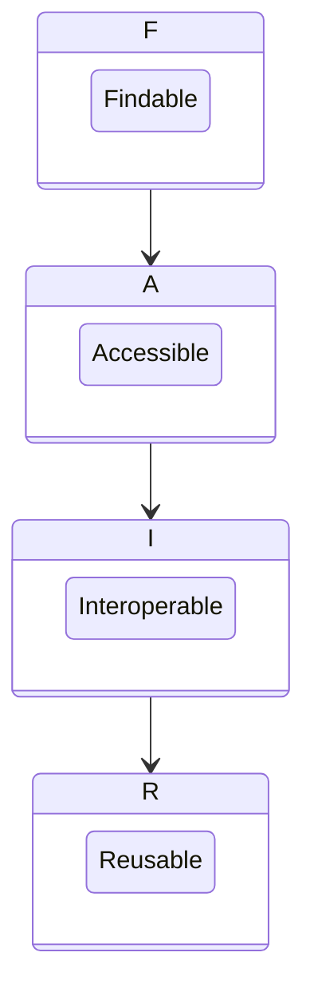

FAIR principles ensure that research outputs are findable, accessible, interoperable and reusable. In practice, they enable higher visibility and reuse potential for data.

A research data management plan must consider who will be able to reuse the data, under what conditions, and how. If circumstances change during a project, you can review the data management plan and update it accordingly.

A key concept (introduced in 2016)[^1] to improve your data sharing practices is that data should be FAIR[^2]:

> **Findable:** your data should include metadata and a persistent identifier, to make it discoverable. 
> **Accessible:** data and metadata should be retrievable through a free and open communications protocol. Metadata should always be available, even if data is not. 
> **Interoperable:** metadata should use controlled vocabularies [3], be machine-readable and include references to other metadata. Data should use open formats whenever possible. 
> **Reusable:** metadata should conform to standards for greatest reusability. It should be clear to humans and machines alike. Data should also come with a clear and accessible licence to regulate reuse.

[^1]: The FAIR Guiding Principles for scientific data management and stewardship (DOI) http://dx.doi.org/10.1038/sdata.2016.18
[^2]: Guiding principles for findable, accessible, interoperable and re-usable data https://www.force11.org/fairprinciples